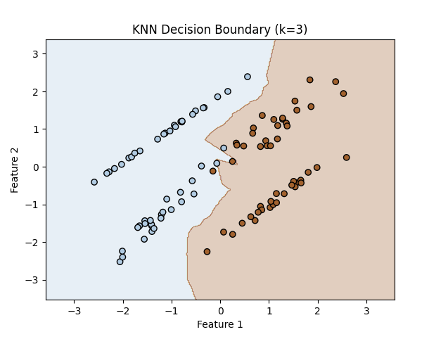

# K-Nearest Neighbors (KNN) Classifier

[](https://www.python.org/downloads/)
[](https://opensource.org/licenses/MIT)


A customizable k-Nearest Neighbors (KNN) classifier implementation from scratch with support for multiple distance metrics, hyperparameter tuning, and efficient computation modes. Ideal for educational purposes and lightweight ML workflows.



## Features ✨

- **4 Distance Metrics**: 
  - L1 (Manhattan)
  - L2 (Euclidean)
  - Cosine Similarity
  - Chebyshev
- **3 Computation Modes**:
  - Two loops (simple, for validation)
  - One loop (partial vectorization)
  - No loops (full vectorization)
- **Automatic k-Selection**: Cross-validation to choose optimal `k`
- **Scikit-Learn Compatible API**: Use with `DecisionBoundaryDisplay` and other tools
- **Extensive Testing**: 95%+ test coverage

## Installation 📦

1. **Clone the repository**:
   ```bash
   git clone https://github.com/Blase-AI/knn.git
   cd knn-classifier
   ```
   
## Requirements 📋

- **Python 3.8+**
- **NumPy**
- **scikit-learn** (for testing/visualization)
- **matplotlib** (for examples)
  
## Basic Usage 🚀
```bash
from knn import KNearestNeighbor
import numpy as np

# Generate sample data
X_train = np.random.rand(100, 5)
y_train = np.random.randint(0, 2, 100)
X_test = np.random.rand(10, 5)

# Initialize and train
knn = KNearestNeighbor()
knn.fit(X_train, y_train)

# Predict with k=3 (Euclidean distance)
predictions = knn.predict(X_test, k=3)
```

## Hyperparameter Tuning 🎛️
```bash
# Find optimal k
X_val = np.random.rand(20, 5)
y_val = np.random.randint(0, 2, 20)

best_k = knn.choose_best_k(
    X_val, 
    y_val, 
    k_values=[1, 3, 5, 7], 
    verbose=True
)
```

## Test Coverage Includes ✅

- **Distance Metric Correctness**  
  Tests for L1, L2, Cosine, and Chebyshev distances.

- **Edge Cases** 
  - `k > n_samples` (k larger than the number of training samples)  
  - Tie-breaking in voting (equal votes for multiple classes)  

- **Vectorization Equivalence**  
  Ensures that one-loop and no-loop implementations produce the same results as the two-loop version.

- **Hyperparameter Selection Logic**   
  Validates the `choose_best_k` method for selecting the optimal `k`.

## Contributing 🤝

Contributions are welcome! If you'd like to contribute, please follow these steps:

1. **Fork the repository**   
   Click the "Fork" button at the top right of this repository to create your copy.

2. **Create a feature branch**  
   Create a new branch for your feature or bugfix:  
   ```bash
   git checkout -b feature/amazing-feature
   ```
   
3. **Commit your changes**
   Make your changes and commit them with a clear message:
   ```bash
   git commit -m 'Add some amazing feature'
   ```
   
4. **Push to the branch **
   Push your changes to your forked repository:
   ```bash
    git push origin feature/amazing-feature
   ```
   
5. **Open a Pull Request**
   Go to the original repository and click "New Pull Request". Describe your changes and submit!


## Author 👨‍💻

- **Name**: Alexander
- **Email**: [mail](a.a.ponomarev.software@gmail.com)  
- **GitHub**: [Blase-AI](https://github.com/Blase-AI)  
 

---

Feel free to reach out if you have any questions, suggestions, or just want to connect! 😊
